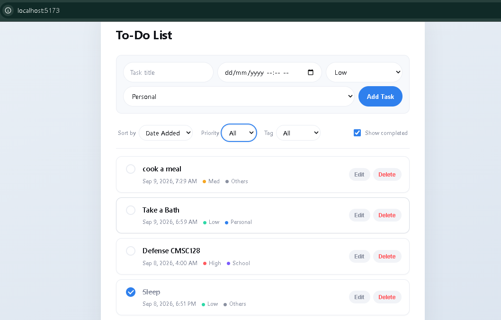
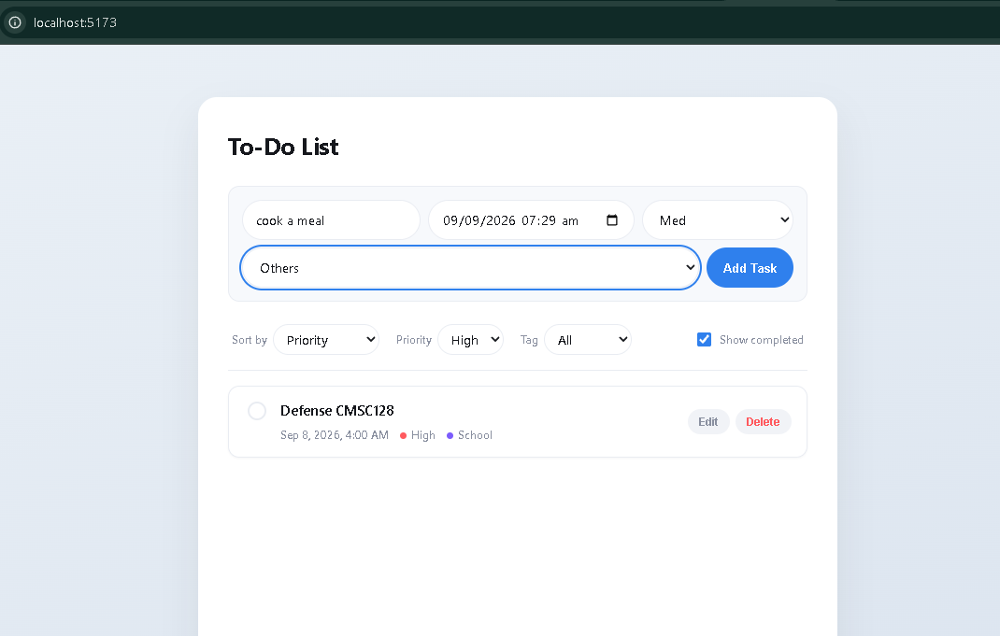
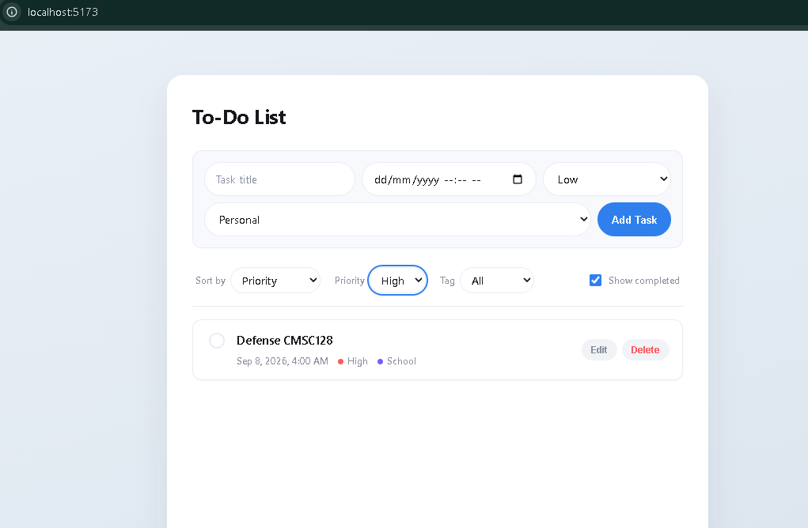
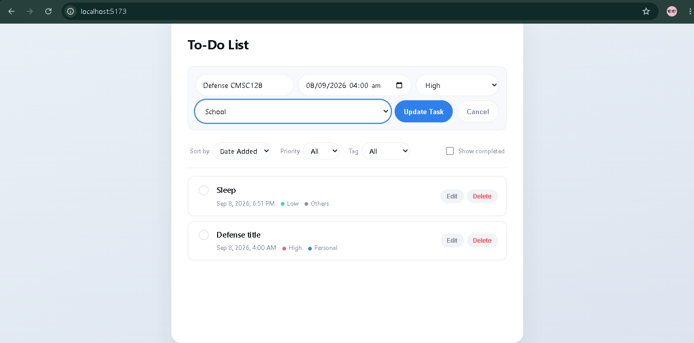
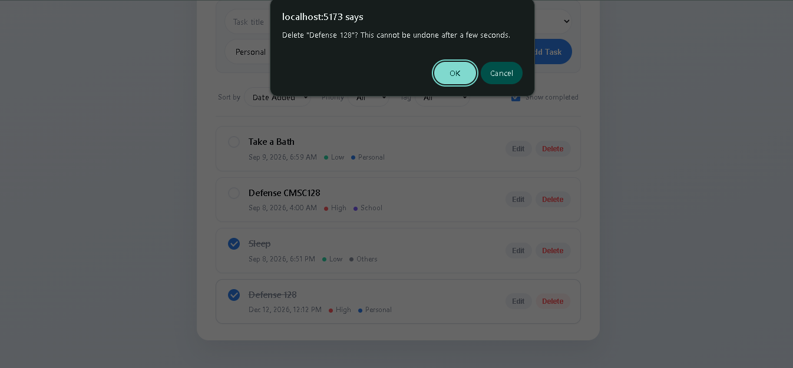

<p align="center"> 
    
    
     
     
     
</p>
    <h1 align="center"> ToDo List App</h1>
    <p align="center"><strong>Full Stack CRUD Application</strong></p> 
    <p align="center"> 
    <a href="#why-this-stack">Tech Stack</a> |
    <a href="#quick-start">Quick Start</a> |
    <a href="#api-endpoints">API Endpoints</a> |
    <a href="#screenshots">Screenshots</a>
</p>

### Why This Stack?

| Technology | Purpose | Benefits |
|------------|---------|----------|
| **FastAPI** | Backend Framework | Fast performance<br> Auto-generated OpenAPI docs<br> Async support |
| **Supabase** | Database |  Managed PostgreSQL<br> Built-in RLS<br> Real-time ready |
| **React** | Frontend UI | Component reusability<br> Virtual DOM<br> Rich ecosystem |

---

##  Quick Start

### Prerequisites

Before you begin, ensure you have installed:

- [Python 3.8+](https://www.python.org/downloads/) - For running FastAPI backend
- [Node.js 16+](https://nodejs.org/) - For running React frontend
- [npm](https://www.npmjs.com/) - Package managers
- [Git](https://git-scm.com/downloads) - For cloning the repository

---
### Configuration & Setup

#### Step 1: Clone the Repository


`git clone https://github.com/TUP-e/cmsc128-Lab1_CRUD_Nice` </br>
`cd cmsc128-Lab1_CRUD_Nice`


### Step 2: Backend Setup (FastAPI)
at the repo root execute 
`cd backend`

|OS|Command|
|-----|-----|
| Windows | `python -m venv venv` </br> `venv\Scripts\activate`|
| Mac/Linux | `python3 -m venv venv` </br> `source venv/bin/activate`|

Also install the python dependencies with `pip install -r requirements.txt`


Create a .env file in the backend/ folder: </br>
`SUPABASE_URL=https://your-project-id.supabase.co` </br>
`SUPABASE_KEY=your-public-anon-key`

Note: Supabase credentials will be provided separately. We are currently in single-user mode. Multi-user authentication is coming soon, which will allow secure, personalized access to your own tasks.


### Step 3: Frontend Setup (React + Vite)
at the repo root execute </br>
`cd frontend` or `cd ../frontend` from the previous step


Create a .env file in the frontend/ folder: </br>
`VITE_API_URL=http://localhost:8000`

then install node dependencies `npm install`

### Local Ports
`http://localhost:8000 ` - FastAPI server </br>
`http://localhost:8000/doc` - Swaggers UI Documentation and Testing </br>
`http://localhost:8000/tasks` - Task list from shared database (JSON) </br>
`http://localhost:5137` - Frontend UI renders React App

Note: Your frontend port may vary (5173, 5174, etc.). Check the terminal output after running npm run dev.

## Startup Commands
for running backend server : </br>
(run inside backend\ directory)
`source venv/Scripts/activate`
`uvicorn app.main:app --reload --port 8000` </br>
for running the frontend UI : </br>
(run inside frontend\ directory)
`npm run dev` requires a running backend


## API Endpoints

### REST API Reference

| Method | Endpoint | Description |
|--------|----------|-------------|
| `GET` | `/tasks` | Get all tasks (non-deleted) |
| `GET` | `/tasks/{id}` | Get single task by ID | 
| `POST` | `/tasks` | Create a new task | 
| `PATCH` | `/tasks/{id}` | Update a task | 
| `DELETE` | `/tasks/{id}` | Soft delete a task | 
| `POST` | `/tasks/{id}/restore` | Restore a deleted task | 


### Example API Calls
#### Create a Task 
```
Request:
POST /tasks
Content-Type: application/json

{
  "title": "Study CMSC 128",
  "due_date": "2026-09-07T20:00:00",
  "priority": "High",
  "tag": "School"
}

Response:
{
  "id": "550e8400-e29b-41d4-a716-446655440000",
  "title": "Study CMSC 128",
  "due_date": "2026-09-07T20:00:00",
  "priority": "High",
  "tag": "School",
  "is_done": false,
  "created_at": "2026-09-07T12:00:00",
  "deleted_at": null
}
```
### Screenshots
| App Overview |
|--------------|
||
||
||
||
||